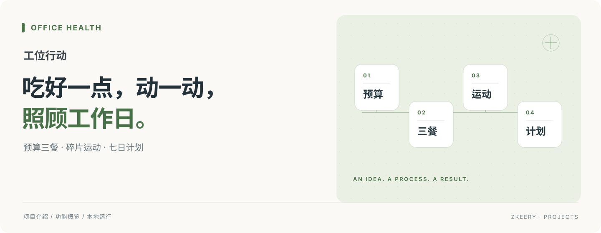

<p align="center"><strong>从一顿饭、几分钟运动开始，照顾工位上的自己。</strong></p>
<p align="center">饮食计划 · 碎片运动 · 每日打卡 · React + TypeScript</p>
<p align="center"><a href="#能做什么">能做什么</a> · <a href="#快速开始">快速开始</a> · <a href="docs/README.md">使用文档</a></p>

## 这是什么

工位行动是面向久坐上班族的健康习惯应用原型。把吃什么、动一动和每日反馈放进一个工作台：按预算安排三餐，跟着计时完成碎片运动，再用打卡和积分记录行动。桌面与手机都有对应布局。

## 能做什么

| 场景 | 功能 |
| --- | --- |
| 不知道今天吃什么 | 设置每日预算和饮食偏好，生成、替换并确认三餐 |
| 想提前安排一周 | 查看从今天起滚动七日的饮食与运动计划 |
| 工作间隙动一动 | 分段动作指导、运动计时、暂停继续和完成确认 |
| 记录自己的节奏 | 每日反馈、积分、周成就与个人档案 |
| 找附近的去处 | 高德地图搜索，查询餐饮、咖啡、公园和运动地点 |

## 怎么用

1. 完成引导，填写预算、久坐情况和饮食偏好。
2. 在「出餐」安排三餐；不合适的餐次可以替换，吃完后确认。
3. 在「运动」选一项跟着练，完成后确认记录。
4. 回到「今日」打卡，在「七日」查看后续计划。

## 快速开始

准备 Node.js 24，然后运行：

```bash
git clone https://github.com/Zkeery/office-health-app.git
cd office-health-app
npm ci
cp .env.example .env.local
npm run dev -- --host 127.0.0.1
```

打开 [http://127.0.0.1:5173](http://127.0.0.1:5173)。不配置地图凭据也能体验其他页面；地图需填写自己的高德 Web 端 Key 与安全密钥，操作见[地图配置](docs/amap-setup.md)。

构建与本地预览：

```bash
npm run build
npm run preview
```

## 当前范围

餐单使用示例菜品和参考价格；会员开通为模拟流程，没有真实支付。个人资料、计划与记录保存在当前浏览器的 localStorage，清除浏览器数据会丢失记录，也不会跨设备同步。免费版展示近三天完整计划，模拟会员可查看七天。

地图使用真实高德服务，依赖服务端代理；部署时需保留相应代理配置。更多使用说明与开发资料见[文档中心](docs/README.md)。
