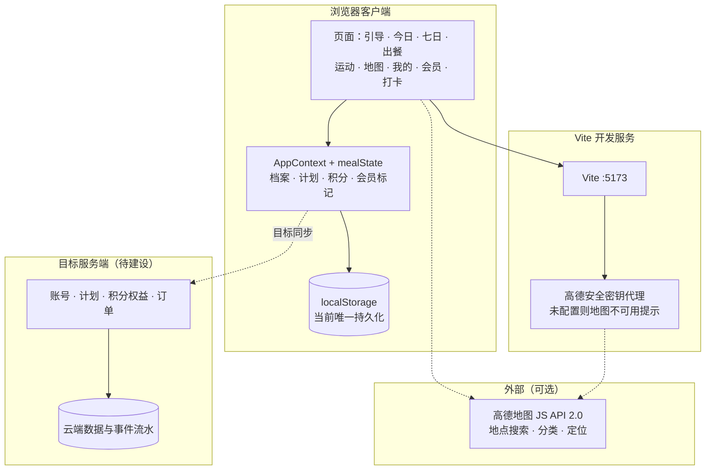
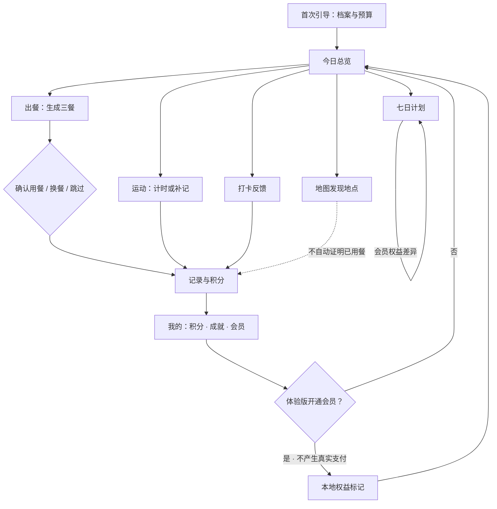
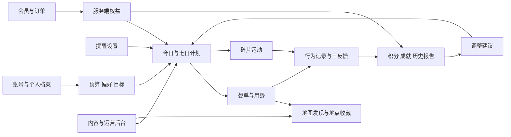

# 工位行动 PRD V1.0

**产品定位：工位行动是一款面向久坐上班族的日常饮食与运动管理产品，帮助用户在预算、时间和个人偏好的约束下安排三餐与碎片运动，找到附近可去的场所，并通过真实记录、反馈和长期回顾形成可持续的生活习惯。**

完整产品围绕“了解自己 → 制定计划 → 执行行动 → 记录反馈 → 调整下一步”组织功能。今日、七日、出餐、运动、地图和我的构成主要入口，账号同步、提醒、会员、报告和运营管理支撑持续使用。

本文定义完整目标产品，而不以当前原型已经实现的功能为边界。未实现的功能仍属于需求，并按阶段逐步交付；当前实现状态、待确认方案与验收证据分别记录，不把演示效果视为完整产品能力。

### 文档信息

| 项 | 内容 |
| --- | --- |
| 文档名称 | 工位行动 · 产品需求文档 |
| 版本 | V1.0 |
| 更新日期 | 2026-10-06 |
| 负责人 | 小龙兰 |

### 阅读口径

- **现有**：在当前代码中有对应实现，不自动等于完成端到端验收。
- **部分实现**：已有入口、局部能力或演示逻辑，距离目标要求仍有缺口。
- **待建设**：已纳入完整产品范围，当前未找到对应实现。
- **待外部验证**：依赖凭据、第三方服务或真实用户环境，尚无完整验证证据。
- **P0**：保证基础闭环、事实准确和数据可靠所必需；**P1**：完整个人服务与正式商业化的必要能力；**P2**：在基础可靠后提升个性化、内容和运营能力。优先级用于安排顺序，不表示删除低优先级需求。

正文中的“应、必须、不得”为目标产品验收要求。“当前”描述已有实现。“建议、待确认”表示方案尚需产品决策，不视为已经批准上线。

---

## 1. 用户问题、使用场景与产品目标

### 1.1 为什么做这个产品

久坐上班族每天需要反复处理几类小决策：今天吃什么、预算够不够、什么时候活动、附近哪里适合吃饭或散步。工作节奏容易打断计划，单次建议也难以形成持续习惯。已有记录若不能反映真实执行情况，用户就无法判断计划是否适合自己。

工位行动要减少安排和记录的负担，把一天拆成可完成的小行动，同时保留预算、饮食限制、可用时间和个人选择。用户没有完成计划时，应能调整、跳过或如实记录，而不是被迫填写“已完成”。

上述问题来自产品定位和现有流程分析，尚不代表已经完成系统性用户访谈；改善健康、节省费用和提高坚持率的幅度均需后续验证。

### 1.2 为谁服务

| 用户 | 主要困难 | 产品帮助完成的事 |
| --- | --- | --- |
| 久坐办公人群 | 连续工作、忘记活动、缺少低门槛动作 | 在合适时段完成短时运动，记录完成情况并调整安排 |
| 经常吃外卖或在外就餐的人 | 菜品选择重复，难以兼顾预算与偏好 | 生成有依据的三餐建议，换餐或记录自行选择的餐食 |
| 有明确饮食偏好的人 | 推荐经常忽略不辣、素食等要求 | 显式设置限制，在可核验范围内匹配；不满足时说明原因 |
| 想形成习惯但不想复杂记账的人 | 不愿记录大量细节，短期反馈不足 | 用少量字段完成记录，查看连续行动、预算和精力趋势 |
| 经常更换办公地点的人 | 不熟悉附近餐厅、步行空间或运动场所 | 按目标区域查询真实地点，收藏并进入外部导航 |

目标首先覆盖具有自主使用能力的成年办公人群。现有年龄选项只有22–55岁范围，完整版本应允许其他成年年龄段和“不愿透露”；年龄本身不能推导疾病、身体能力或精确营养需求。

需要诊疗、特殊疾病膳食处方或康复训练的人不属于本版专业服务对象。产品可以记录用户主动提供的限制，但不能把一般建议包装为临床方案。

### 1.3 主要使用场景

| 场景 | 用户动作 | 产品应提供的过程 | 最终结果 |
| --- | --- | --- | --- |
| 首次使用 | 填写预算、饮食偏好、可用运动时间和目标 | 分步建档，解释字段用途，形成第一份可执行计划 | 今日三餐建议、短时运动安排与可修改入口 |
| 午餐前选择 | 查看餐单，发现不想吃或预算变化 | 调整未确认餐次；可查看真实地点或自行记录 | 符合当前约束的选择，不改写已经发生的用餐 |
| 工作间隙活动 | 选择一个适合空间与时间的动作 | 展示动作与阶段，计时、暂停并确认完成 | 一条真实运动记录和对应积分 |
| 午休找去处 | 搜索办公区域，筛选餐厅或公园 | 显示真实来源、查询范围与位置；允许打开导航 | 可核对的地点信息，不把地点查询当成菜单验证 |
| 晚间回顾 | 填写按时吃饭、活动与精力反馈 | 复用已记录事实，保留主观回答，给出下一步建议 | 当日记录和可解释的次日调整建议 |
| 连续使用一周 | 查看执行率、预算和精力变化 | 展示有样本量说明的趋势与缺失数据 | 可理解的周报及可接受、可拒绝的调整建议 |
| 更换设备 | 登录已有账号 | 同步个人档案、记录和权益，处理本地数据冲突 | 可继续使用，不重复领奖或覆盖历史 |
| 使用会员 | 比较权益、下单、查询订单或退款 | 透明展示价格与额度，服务端确认支付和权益 | 可追踪、可恢复、可取消的会员服务 |

### 1.4 问题与需求对应

| 用户问题 | 对应需求 | 判断是否解决的依据 |
| --- | --- | --- |
| 计划不符合预算或饮食限制 | 硬约束校验、可解释的无解状态、手动安排 | 有效餐单不超预算，不包含已明确排除且可核验的项 |
| 计划与实际生活脱节 | 替换、跳过、补记、实际支出与偏好反馈 | 用户能记录真实行为，计划完成率不依赖强制“打卡成功” |
| 改一次资料就丢记录 | 计划版本与行为记录分离 | 修改未来安排不会改写已确认用餐、运动与历史反馈 |
| 忘记行动或提醒过多 | 可选择的提醒时间、工作日、静默和关闭 | 提醒可控制，不在任务完成后重复催促 |
| 不知道是否有改善 | 历史、趋势、周报及数据完整度 | 每个结论可回到对应日期和原始记录 |
| 想找真实地点，但演示信息混杂 | 数据来源标识、地图服务、地点与菜单分层 | 示例价格、真实地点和实际消费三种事实不会混淆 |
| 付费后权益不清或不到账 | 权益矩阵、订单状态、支付核验、售后 | 付款与权益一致，异常可查询、可恢复 |
| 长期使用缺乏信任 | 账号同步、数据控制、反馈处理 | 用户能找回记录、导出和删除自己的数据 |

### 1.5 完整产品边界

完整范围包括：访客与账号、档案与目标、今日总览、滚动七日计划、三餐安排与用餐记录、真实地点发现、碎片运动、日反馈、积分成就、提醒、历史与报告、推荐调整、会员订单、设置与数据管理、用户反馈及运营后台。

不要求一次开发完成，但每项范围都应有入口、规则、状态、异常处理、数据归属和验收条件。每次迭代只发布已验证的能力，未开放功能不得通过付费权益文案制造已可使用的印象。

本版不包含餐饮自营交易与配送、医疗诊断、药物建议、专业康复处方、社交排行榜、企业员工健康监控或硬件设备接入。第三方导航属于完整范围；外卖下单、可穿戴设备与企业版如后续需要，另立需求和数据边界。

---

### 1.6 非目标

本版完整需求仍描述目标能力，但下列事项**不作为当前原型已交付结论**，也不纳入可对外宣称的完成范围，直至对应阶段验收通过：

- 正式账号体系、真实支付收款、退款与订单后台  
- 服务端积分流水、云端多端同步与冲突合并  
- 未配置凭据时的「真实地图已验收」宣称  
- 医疗诊断、处方、个人精确热量／消耗测定  
- 把浏览器本地体验版会员开通当作已售卖的正式会员服务  

分期建设见第5节；差距见第12节。

## 2. 输入、过程和产物

### 2.1 输入

| 输入类别 | 主要字段 | 是否必需 | 用途与约束 |
| --- | --- | --- | --- |
| 基础档案 | 年龄段、久坐时长、外食频率 | 首次引导可跳过非核心字段 | 用于理解生活习惯，不等于身体评估 |
| 饮食安排 | 每日计划预算、饮食限制、排除食材、三餐偏好 | 预算必填；限制可为空 | 决定可推荐集合；未能核验的限制必须显式处理 |
| 行动目标 | 规律吃饭、控制预算、减少连续久坐、增加轻活动 | 允许使用建议默认项 | 影响计划排序和报告内容；不预设减重目标 |
| 运动条件 | 每次可用时间、可用空间、器械、偏好、需避开的动作 | 生成个性化运动计划前补齐 | 过滤不适合的运动，不凭年龄推断能力 |
| 日程偏好 | 工作日、餐时、休息时段、静默时段、时区 | 启用提醒时配置 | 用于提醒和归属日期，默认不读取系统日历 |
| 地图查询 | 关键词、地图中心、类别、主动定位授权 | 查找地点时输入或选择 | 仅定位行为需要浏览器位置权限 |
| 行为记录 | 用餐事实、运动完成、实际支出、跳过原因 | 由用户主动确认 | 不能由页面停留、倒计时结束或推荐结果代写 |
| 每日反馈 | 是否按时吃饭、是否活动、精力1–5、可选备注 | 提交反馈时按字段校验 | 主观字段不默认代答 |
| 账号与订单 | 登录凭据、套餐、订单及售后信息 | 登录或交易时提供 | 不要求未登录用户先提供交易资料才能试用 |

当前原型直接影响餐单的是预算与饮食备注；年龄、久坐时长和外食频率主要用于展示。完整版本需明确每个字段是否参与推荐，并允许查看和修改。

### 2.2 阶段输入与确认

| 阶段 | 输入 | 系统处理 | 用户确认与可撤销内容 |
| --- | --- | --- | --- |
| 建档 | 预算、偏好与目标 | 校验范围和可支持的限制 | 提交前可返回修改；不自动申请定位或通知 |
| 制定计划 | 当前档案与可用内容 | 生成今日建议和七日行动安排 | 可接受、替换或修改未执行安排 |
| 实际执行 | 餐单、运动、地点 | 显示内容与操作指引 | 用户确认实际用餐或运动；可单独记录计划外行为 |
| 每日反馈 | 实际记录与主观回答 | 汇总当天，保存反馈 | 提交前可取消；完整版本支持更正但不重复计分 |
| 调整计划 | 多日反馈、变化后的约束 | 提出调整及原因 | 用户决定是否应用；保留已执行记录 |
| 阶段回顾 | 历史事件与计划版本 | 计算趋势、生成报告 | 能查看来源，不能由报告反向修改事实记录 |

### 2.3 产物

- **计划产物**：今日餐单、七日饮食与运动安排、替代选项、推荐理由及无法满足的原因。
- **行为产物**：用餐记录、运动记录、每日反馈、实际支出、计划外活动与跳过记录。
- **成长产物**：积分流水、徽章与目标进度、周报及后续月报。
- **服务产物**：收藏地点、提醒设置、会员权益、订单、退款与反馈处理记录。
- **数据控制产物**：账号同步状态、用户数据导出文件、删除申请状态及完成结果。

当前仅部分个人状态存于浏览器；历史餐单虽有数据归档，尚无完整历史浏览和导出界面。上述产物均为完整版本要求，不能由当前存储结构推定已经支持。

### 2.4 产品对象与术语

| 对象 | 含义 | 关键边界 |
| --- | --- | --- |
| 计划预算 | 用户希望一天三餐不超过的参考金额 | 不等于用户实际支付金额 |
| 示例菜品 | 产品内置的演示名称、配方标签和参考价 | 不代表可在某家真实店铺买到 |
| 真实地点 | 来自地图供应商的餐厅、公园或运动场所 | 不自动证明营业状态、价格、菜单或饮食要求 |
| 可核验餐品 | 有可信来源、价格口径及食材信息的候选餐品 | 仅在接入相应数据后开放，来源不明不得冒充已核验 |
| 餐次 | 某个归属日期的早餐、午餐或晚餐 | 是用餐确认和奖励去重单位之一 |
| 计划版本 | 一次生成或调整后的安排快照 | 与执行记录分开；旧版本可追溯 |
| 行为记录 | 用户确认已经发生的行为 | 不随计划重新生成而改写 |
| 有效积分事件 | 满足计分规则且未被重复结算的行为 | 必须有业务唯一标识及原始记录 |
| 七日计划 | 从当前日期起连续七天的未来安排 | 与“最近七天回顾”和“连续打卡”分开计算 |
| 会员权益 | 服务端根据有效订单或授权授予的能力 | 演示开关不属于真实支付凭证 |

### 2.5 页面与模块职责

保留“今日、七日、出餐、运动、地图、我的”六个主要入口。历史报告、目标、提醒、收藏、订单、数据管理和帮助从相关任务入口及“我的”进入，避免所有功能都占据一级导航。

今日负责告诉用户接下来可做什么；七日负责安排；出餐和运动负责执行；地图负责真实地点发现；我的负责个人资料、记录和服务。运营后台使用独立入口和权限，不放入普通用户任务流程。

### 2.6 系统架构概览

当前实现是 **Vite + React** 单页应用（开发默认 `http://127.0.0.1:5173/`），个人状态保存在浏览器 **localStorage**；**无独立业务服务端**。高德 JS API 通过 Vite 开发／预览代理注入安全密钥（见 `server/amap.ts`、`docs/amap-setup.md`）。下图同时标出目标形态中的账号与权益服务，便于分期，不表示已经建成。

### 2.7 主业务流程

### 2.8 模块职责

| 模块 | 职责 | 当前事实 |
| --- | --- | --- |
| 页面路由 | 引导、今日、七日、出餐、运动、地图、我的、会员、打卡 | `src/pages/*`、底部 Tab |
| AppContext / mealState | 档案、当日计划、积分、会员标记、反馈 | 浏览器 localStorage |
| 餐单数据 | 示例菜品、预算过滤、换餐、确认 | `src/data/meals.ts` |
| 运动库 | 时长分段、计时、补记 | `src/data/exercises.ts` |
| 地图 | 高德加载、搜索、分类、定位 | `src/services/amap.ts`；凭据未配置则不可用 |
| 会员页 | 体验版开通／取消展示 | 不产生真实支付 |
| 目标服务端 | 账号、权益、订单、积分流水、提醒 | **待建设** |

### 2.9 产品模块关系

地图发现不直接证明用餐完成，会员购买也不直接产生健康行为记录。各模块通过明确的对象和事件连接。

---

## 3. 用户主链路与跨模块规则

### 3.1 首次使用与恢复

1. 用户可以先了解产品并选择访客试用或登录；非核心信息允许稍后补齐。
2. 引导先收集能影响当前任务的预算和饮食限制，再补目标、运动条件与提醒偏好。
3. 若当前条件无法生成计划，保留资料，说明具体原因并允许修改或自行安排，不伪造可用结果。
4. 返回用户直接看到当天状态；未提交草稿应按其归属设备或账号恢复。
5. 访客登录时先展示本地数据与账号数据的合并方案；存在冲突不得静默覆盖。
6. 退出账号后清除该账号在当前设备的受保护缓存；重新登录能从服务端恢复。访客与账号数据不混用。

### 3.2 一天的执行闭环

用户查看今日安排，选择餐单或计划外用餐，完成一项或多项运动，再提交当日反馈。完成与未完成都允许如实记录，跳过任务不会抹去其他进展。

“推荐了”“开始了”“计时结束了”“用户确认完成了”是不同状态。只有符合规则的事实确认才可记为完成和发放积分。用户可以仅完成一部分，不要求先完成三餐和全部运动才能反馈。

### 3.3 计划生成、编辑与确认

- 预算、可核验的饮食排除条件和运动限制为硬约束；口味、三餐分配比例和内容丰富度为偏好。
- 今日未确认部分可修改；已确认用餐和已完成运动保留原始快照。
- 同一天重复生成、换餐、重复点击和跨设备提交不能重复增加奖励。
- 修改档案时先检查影响，说明哪些未来安排会更新、哪些事实记录会保留。
- 旧计划与新规则冲突时显示冲突来源，不自动改写旧事实；必要时停止推荐或确认入口，同时保留独立的实际记录入口。
- 对未来某一天的局部调整，不应无提示覆盖其他已手工安排的日期。
- 推荐方案被接受后生成版本；被拒绝时保留原计划和拒绝原因，不强行应用。

### 3.4 日期、跨日与时区

日期口径统一应用于计划、用餐、运动、反馈、奖励、提醒和报告。当前原型使用设备本地日期；云端版本应保存账号时区、事件发生时间和归属日期。

跨日时归档上一日计划一次，新日不继承上一日确认状态；历史积分和执行记录保留。新日按有效档案生成，完整版本须明确继承用户保存的三餐偏好；当前代码跨日会使用默认20/40/40比例，这是待补齐项。

最近七天是今天及之前六天；未来七日是今天及之后六天；自然周、连续天数各自独立命名和计算。修改时区不得重算已结算奖励以产生重复收益。离线补传按原归属日期合并，补记规则见第10节。

### 3.5 失败、中断与离线

| 中断点 | 应保留什么 | 恢复要求 |
| --- | --- | --- |
| 表单未提交即切页 | 允许恢复的个人草稿 | 明确草稿未保存为正式资料；取消时可丢弃 |
| 生成失败 | 原有效计划、输入参数 | 显示原因，允许重试或调整，不扣成功额度 |
| 地图不可用 | 其他业务模块及已保存地点 | 说明无法查询，不能回填虚构地点 |
| 运动中断 | 会话状态与剩余时长 | 完整版本以暂停态恢复；中断时间不计为运动 |
| 保存记录失败 | 待提交记录与业务唯一标识 | 明确“待同步”，重试不重复发放积分 |
| 支付返回异常 | 订单和查询入口 | 通过服务端查询核实，不依赖跳转页面判定成功 |
| 数据合并冲突 | 两侧原始版本 | 提示冲突及选择，已有已执行记录不丢失 |

离线模式仅开放已缓存的资料、计划与内容，以及可延迟同步的个人记录。地图查询、账号验证和支付等联网服务明确标注不可用；离线奖励显示待核验，不伪装成服务端已到账。

### 3.6 反馈如何改变后续计划

调整应有可追溯依据，例如用户连续跳过某种运动、主动降低预算、把某个菜品标为不喜欢，或改变了工作时段。系统先给出可理解的原因与调整范围，再由用户接受。

精力评分、未完成次数等单一信号不足以推断疾病或精确营养缺口。历史数据不足时显示“继续记录后可提供趋势”，不给出虚构的个性化结论。

### 3.7 完整系统职责

当前原型以浏览器为中心，Vite 提供地图配置和代理。完整版本需要账号与数据服务、规则与推荐服务、积分权益服务、支付订单、提醒调度、报告统计、内容后台和第三方适配。

这些是逻辑职责，不要求拆成多个独立服务。技术方案应按阶段选择能够保证事务、一致性、备份和可观测性的最小实现，不为模块名称增加无必要的部署成本。

---

## 4. 什么算安排得好、使用得顺

### 4.1 成功标准

| 维度 | 目标要求 | 验收方法 |
| --- | --- | --- |
| 可执行 | 每个建议包含必要信息、操作入口和替代路径 | 真实用户能从计划进入执行与记录 |
| 约束正确 | 有效餐单不超计划预算，不忽略已支持的饮食排除；运动符合已声明限制 | 组合测试、边界样例和人工抽查 |
| 事实准确 | 计划、执行、主观反馈和支付事实分开 | 检查数据对象、界面和报告，不混算 |
| 可调整 | 能改未执行安排，能拒绝建议，能如实记录偏离计划的行为 | 完成局部修改和计划外记录路径 |
| 可恢复 | 刷新、离线、重试和换设备不丢事实、不重复记分 | 中断、重放、合并和恢复测试 |
| 可解释 | 用户知道推荐原因、数据来源和无法推荐的条件 | 典型正向与无解样例走查 |
| 可持续 | 用户能控制提醒和目标，能理解长期变化 | 试用访谈和分阶段使用数据 |
| 权益可信 | 宣传权益、实际可用能力、订单和退款状态一致 | 免费/会员矩阵及订单全状态验收 |

### 4.2 可接受与不可接受的不足

内容不够丰富、推荐重复、视觉细节有待优化，可以进入后续迭代，但需明确真实边界。无法找到完全贴合三餐比例的组合时，可以在总预算和饮食硬约束内提供较接近的组合。

超预算仍宣称达标、把未知食材说成满足过敏限制、假地点冒充真实店铺、未运动自动完成、重复领奖、账号间数据混读和未支付授予真实权益，不能作为可接受的首版不足。

没有可行方案时，清晰的失败原因和可执行的调整入口就是正确结果，不能为了显示成功而放宽硬约束。

### 4.3 产品效果指标

以下为需要建立的指标，不代表已有数值或已经达成。首轮试用建立基线后，再确定阶段目标。

| 指标 | 口径 | 使用目的 |
| --- | --- | --- |
| 引导完成率 | 完成建档的去重用户 / 开始引导的去重用户 | 判断首次使用阻力 |
| 首日有效行动率 | 新用户中至少完成一次有效用餐或运动记录的比例 | 判断是否从浏览转为实际使用 |
| 有效出餐率 | 通过全部硬约束且用户可查看的生成结果 / 合法生成请求 | 定位内容覆盖不足；“无解”单独统计 |
| 推荐采纳率 | 被接受的建议 / 已完整展示的建议 | 判断建议是否有用，不等同于健康改善 |
| 七日活跃留存 | 首次使用后第七日发生有效产品行为的用户比例 | 判断持续使用；与七天内任意回访分开 |
| 计划执行率 | 已完成的应执行项目 / 当期计划项目 | 跳过、取消和缺失分别展示，不能删除失败项抬高结果 |
| 预算记录完整率 | 有实际支出记录的用餐 / 已记录用餐 | 决定是否适合提供实际消费分析 |
| 提醒有效率 | 可归因时间窗内完成目标行为 / 成功送达的提醒 | 同时观察关闭和投诉，不只追求点击 |
| 付费服务质量 | 支付后权益异常率、退款处理完成率 | 检验商业化闭环 |
| 推荐投诉与纠错率 | 已核实问题 / 有效推荐量 | 反哺内容审核和规则修正 |

首轮可采用小规模连续试用，记录“是否完成任务、遇到什么阻碍、为何拒绝建议”。试用规模、周期和指标阈值在发布计划中确认，不在需求稿中虚构效果数据。

---

## 5. 交付阶段与优先级

| 阶段 | 目标 | 必交付范围 | 退出条件 |
| --- | --- | --- | --- |
| 阶段A 原型事实校准 | 当前功能能按真实边界使用 | 现有流程回归；地图配置与错误态；会员文案校准；日期口径；数据恢复风险说明 | P0现有缺陷处理完成，功能与宣传一致，真实依赖完成验证或明确关闭 |
| 阶段B 个人使用闭环 | 一个人可以连续使用并回顾 | 目标与运动条件、完整七日安排、计划外记录、历史查询、积分流水、提醒设置、数据导出和恢复 | 跨日、编辑、中断和连续使用用例通过；样本用户能完成一周任务 |
| 阶段C 账号与正式服务 | 换设备也能可靠继续 | 登录、云同步、访客迁移、冲突处理、访问隔离、内容后台、反馈处理、基础运营监测 | 账号隔离、恢复与备份演练通过；来源和内容维护责任明确 |
| 阶段D 会员商业化 | 交易和权益完整可信 | 经确认的套餐与权益、订单、支付、到期、退款、客服和后台核查 | 支付全状态及退款验收通过；未完成权益不售卖 |
| 阶段E 推荐与运营优化 | 根据真实使用持续改善 | 可解释的动态建议、真实餐品数据扩展、周/月报告、分群配置和实验 | 推荐质量、费用、效果与纠错机制达到已确认门槛 |

P0规则贯穿所有阶段，任何新增功能破坏预算、事实记录、奖励去重或账号隔离，都不能因阶段靠后而降低标准。

### 5.1 依赖关系

云端同步先于跨设备权益与正式收费；订单和退款先于会员正式售卖；可信餐品来源先于真实菜单推荐；有效记录及样本量先于趋势结论；通知授权和服务可达性先于关闭页面后提醒的宣传。

基础推荐可以使用确定性规则。是否接入模型不阻塞账号、预算校验、计划执行、记录与报告建设。

### 5.2 后续增强

多周计划模板、更多运动内容、收藏组合、可选择的报告维度、跨区域地点数据、接入经过验证的营养信息，以及对常用操作的进一步简化，均可按效果逐步推进。

社交、企业版、设备接入与餐饮交易不自动并入上述阶段；需要单独确认目标用户、成本、数据和交付范围。

---

## 6. 推荐、外部服务与成本约束

### 6.1 推荐职责

完整推荐分三步：先校验输入并过滤硬约束，再对可行候选排序，最后解释方案。随机变化或模型生成都不能绕过候选数据的可核验属性。

餐单排序可考虑预算分配、用户喜好、近期重复度及可取得的可靠数据。运动排序可考虑可用时间、动作排除、器械与空间、近期完成情况。会员差异主要体现在服务范围和调整能力，不能把必要安全校验设为付费功能。

### 6.2 模型能力

当前无大模型调用。完整版本可在P2阶段引入自然语言偏好解析、建议说明和周报解读，但属于可替换的辅助能力；供应商与模型未确定。

若引入，必须满足：

1. 输出有结构校验，引用实际记录，数值由确定性代码计算。
2. 不生成虚构菜价、商家菜单、积分、订单或医疗结论。
3. 对不支持的饮食限制明确返回未知，不通过模型猜测补齐。
4. 用户可查看模型建议并决定是否应用；模型不直接修改已发生记录、付费订单或权益。
5. 有超时、有限重试、预算上限和无需模型的降级路径；失败不影响基础记录与查看。

### 6.3 外部依赖

| 服务 | 完整产品用途 | 失败时行为 | 待确认事项 |
| --- | --- | --- | --- |
| 地图与地点服务 | 展示底图、搜索、定位和导航衔接 | 显示不可用并保留其他功能 | 服务商套餐、额度、域名与使用范围 |
| 短信或其他登录服务 | 账号验证与恢复 | 保留草稿，可重试，有频率限制 | 主登录方式、成本与恢复方案 |
| 支付服务 | 会员收款、状态查询、退款 | 订单保持可查询，不虚报成功 | 商户主体、渠道、费用和退款规则 |
| 通知服务 | 提醒、服务消息 | 显示未授权或未送达，不自动改用其他渠道 | 浏览器推送、邮件或短信的首期组合 |
| 餐品和内容来源 | 真实餐品、运动内容与媒体 | 标记过期或停用；保留历史快照 | 数据来源、使用权、更新频率与维护责任 |
| 模型服务 可选 | 解析与说明 | 使用规则和模板，明确能力降级 | 供应商、调用上限、数据传递范围 |

### 6.4 费用控制

分别统计登录验证、地图查询、通知、存储、支付渠道和可选模型费用。上线前设定月预算、单用户日调用上限、告警阈值和超限行为；未确定金额时不创建付费资源、不宣称使用成本已被验证。

查询合并、缓存和重复请求去重应降低无效成本，但不能导致位置或价格来源过期却无提示。地图缓存需遵循实际供应商约束，具体保留策略在接入时确认。

---

## 7. 数据与非功能要求

### 7.1 需要持久保存的数据

| 数据 | 主要内容 | 归属与保存原则 |
| --- | --- | --- |
| 账号与登录信息 | 账号标识、验证渠道、会话与设备 | 账号隔离，不在普通页面暴露认证凭据 |
| 档案与偏好 | 预算、饮食要求、目标、运动条件、时区 | 保存版本与更新时间，支持导出、修改和删除 |
| 计划 | 日期、餐次、运动安排、来源、规则和版本 | 与执行事实分离，历史快照可追溯 |
| 用餐与运动记录 | 实际确认、补记、时长、可选支出、归属日期 | 支持纠错和幂等同步，保留必要变更关系 |
| 每日反馈 | 主观回答、备注和修改记录 | 不把缺失值当作否或0分 |
| 积分与成就 | 事件、分值、倍率、规则版本、冲正 | 可解释余额变化，不能只存累计数字 |
| 提醒与目标 | 时间表、授权、静默、完成与发送结果 | 可暂停、关闭；不把配置成功写成送达成功 |
| 地点收藏 | 地点标识、名称、来源及收藏时间 | 保存用户主动收藏，不默认积累定位轨迹 |
| 订单与权益 | 套餐快照、金额、支付和退款状态、有效期 | 服务端为准，支持核查和对账 |
| 反馈与运营配置 | 工单、处理结果、规则版本、发布记录 | 按职责授权，敏感内容按需访问 |

数据保留时长、删除等待期和备份过期时间是上线配置项，需在上线前确认并告知用户。不得把“暂未制定保留规则”写成“永久保留且永不丢失”。

### 7.2 数据恢复与一致性

访客模式明确提示本机保存的边界，提供导出和恢复途径。账号模式使用云端持久保存，浏览器缓存不作为唯一事实来源。

客户端使用业务唯一标识重试写入，服务端按相同标识返回同一结果。计划修改与事实记录采用版本检查；积分与对应事件应在一个可恢复的事务中结算。

清除站点数据、退出账号、重置引导和删除账号是四种不同操作，应显示准确影响范围。重置偏好不应默认删除付费订单或云端历史；正式删除数据时需明确哪些内容仍有必要保留以及何时处理完成。

### 7.3 性能与可靠性

以下为建议的目标验收基线，应在指定设备、网络和测试数据规模下记录实测结果：

| 项 | 目标 |
| --- | --- |
| 首屏 | 常见移动设备和稳定网络下，可交互主要内容P95不超过3秒；地图独立加载 |
| 普通保存与查询 | 自有服务常规请求P95不超过1.5秒；较慢操作显示处理状态 |
| 本地规则出餐 | 常规内容规模下1秒内返回结果或无解原因 |
| 第三方查询 | 设置明确超时和重试入口；不无限等待或自动无限重试 |
| 积分与订单 | 重放相同请求不产生重复奖励、重复扣款或重复权益 |
| 恢复 | 有自动备份和恢复演练；RPO、RTO在技术方案与上线计划中定值 |
| 可观测性 | 关键错误有请求标识和可定位原因；不记录密钥、完整敏感备注或不必要的位置 |
| 降级 | 地图、模型、通知故障不阻塞已保存记录的查看及允许离线的操作 |

### 7.4 视觉与交互

延续当前暖色背景、橙色强调色、卡片和中文优先的视觉基础，重点表达“下一步可以做什么”。桌面利用宽屏展示计划与内容，移动端保留清晰的单列任务路径。

输入、加载、空状态、无解、失败、成功、只读和权限不足都应有独立表现。禁用按钮需说明原因；颜色不能成为唯一状态信息。表单有标签，弹窗可通过键盘操作，核心动作有焦点反馈。

移动端适配至少覆盖360–430px宽度，桌面覆盖1280px及以上；支持文本放大，关键按钮不被底部导航、键盘或地图浮层遮挡。前进、后退、深链接和刷新应保持合理位置与草稿状态。

### 7.5 健康内容与事实边界

菜品偏好标签、营业信息、价格、热量和运动消耗都需要有来源和适用说明。示例估算不得显示为个人实测值；未掌握身高、体重、强度等信息时，不提供精确到个人的能量结论。

运动内容需具备步骤、总时长、适用条件和不适时停止的操作。用户可以排除某类动作；系统不得因积分激励要求带痛坚持或把动作替换成用户已排除内容。

未知过敏信息、无法核验的配方以及特殊医学饮食，不自动宣称满足。可以保留用户要求、停止自动匹配并提供手动记录，不要求用户先删除真实限制才能继续使用其他功能。

### 7.6 权限、隐私与用户控制

位置、通知与后续可能增加的相机等权限按使用场景请求，拒绝后保留可行替代路径。位置查询由浏览器和地图服务处理，不默认保存持续轨迹；收藏地点与实时定位分别说明。

用户可查看资料、修改偏好、导出数据、管理登录设备、关闭提醒和申请删除账号。普通用户不能读写其他账号资料；后台按岗位最小授权，访问、导出和修改可追溯。

若启用第三方模型，发送的数据类型必须明确；不默认上传完整健康备注、精确位置、登录信息或订单数据。

---

## 8. 上线、账号与商业化

### 8.1 访客、普通用户、会员与运营角色

| 角色 | 可用能力 | 必要限制 |
| --- | --- | --- |
| 访客 | 体验基础计划、运动和本地记录 | 明确本机数据边界；交易前需建立可恢复的账号关系 |
| 普通账号 | 保存个人数据、同步、基础计划、地图和报告基础项 | 仅可访问本人数据；额度和权益可查看 |
| 会员 | 已发布并在订单中列明的增强能力 | 以有效期与套餐快照判定，不以客户端开关判定 |
| 内容运营 | 维护菜品、运动、说明与推荐配置 | 不默认读取全部个人敏感资料 |
| 客服与订单运营 | 在授权范围处理工单、订单与退款 | 记录操作依据与结果，不擅自修改健康事实 |
| 管理员 | 权限管理、系统配置、审计和发布 | 高影响操作有确认、记录和恢复方案 |

首期登录方式建议以手机号验证码为主、保留可扩展账号标识；这是待确认方案。短信不可达、验证码过期、频率限制、账号找回和设备退出都必须形成完整流程。

### 8.2 免费与会员权益

| 权益 | 当前情况 | 完整版本方案 |
| --- | --- | --- |
| 今日餐单与基础记录 | 已有 | 保留基础可用能力 |
| 七日计划 | 免费显示从今天起前3天，会员显示7天 | 以公开权益控制可见范围；完整七日计划需具备真实内容 |
| 换餐与整日调整 | 文案宣称限制，代码未实际按会员限制 | 额度服务统一控制；次数及会员上限待确认 |
| 动态调整 | 有宣传文案，没有完整个性化链路 | 上线且通过验收后再纳入售卖权益 |
| 积分倍率 | 免费1倍、演示会员2倍 | 建议沿用；按事件发生时权益计分，不追溯翻倍 |
| 报告与提醒 | 尚未完整实现 | 基础回顾和必要提醒保持可用；高级项与套餐一并确认 |
| 阶段奖励 | 有进度和文案，缺少完整奖励对象 | 先实现徽章与领取记录，再描述具体权益 |

当前会员页展示“18元/月”，属于演示价格，不视为正式定价决策。正式套餐价格、期限、免费额度、试用、优惠、退款和是否自动续费均须确认并保存版本。

推荐首期采用一次性订阅期限、到期提醒和用户主动续费，不默认开通自动续费。若后续新增自动续费，必须单独提供明确授权、关闭入口和扣费前通知。

### 8.3 支付与售后原则

下单前展示应付金额、有效期、权益和退款规则。用户重复点击只产生同一有效支付意图；支付成功以服务端核验为准。权益延迟时提供查询恢复，重复回调不能重复增加时长。

取消支付与取消会员续费不同；退款申请、退款处理中和退款成功不同。退款后权益如何收回，部分退款如何处理，必须按订单采用的规则版本执行，不临时由客服自由解释。

### 8.4 发布前条件

账号隔离、可恢复数据、真实依赖配置、关键错误监测、内容可用性、权益一致性、订单售后和用户数据控制应按所发布范围逐项验收。未提供真实支付时始终保持“体验版开通（不产生真实支付）”标识，不向真实用户收款。

地图需要配置服务端代理和相应域名，单纯发布静态文件不能视为完整服务已上线。部署方式、域名、资源地区和费用在技术方案中另行确认。

---

## 9. 验收设计与当前验证边界

### 9.1 本次已获得的证据

2026-10-04运行现有业务和地图代理测试，共9项通过。覆盖预算与饮食硬约束、非法输入与不支持要求、旧餐单冲突、确认去重、重生成保留记录、跨日归档、运动步骤总时长、最低菜单预算，以及高德配置与代理注入边界。

本地首页、前端入口脚本和地图配置接口均返回HTTP 200；地图配置为未完成。该结果不证明真实地图查询、浏览器完整交互、云端账号、支付或后续新增功能可用。

项目内2026-09-09验证记录属于历史证据，且记录的原项目路径不同；不将历史界面结论直接当成本次当前代码的复验结果。本次编写PRD未更改业务代码，未重跑生产构建或全页面测试。

### 9.2 可执行验收用例

下表是完整产品的验收合同。现有测试只覆盖其中一部分；每次发布需为实际开放范围补充结果与证据。

| 编号 | 场景与输入 | 必须得到的结果 |
| --- | --- | --- |
| AT-01 | 首次访问、未建档 | 能完成最小建档；可跳过非核心字段；不会自动请求定位和通知 |
| AT-02 | 预算19、301、空值或非法数字 | 拒绝保存，显示范围原因，不覆盖原有效预算 |
| AT-03 | 20元且要求素食 | 不伪造三餐；按当前内容库展示无解原因和实际最低参考预算 |
| AT-04 | 合法预算与极端三餐比例 | 总预算和饮食条件不被比例偏好突破 |
| AT-05 | 输入花生过敏等尚不能核验的限制 | 保留原文并明确不能自动核验，不输出“已满足” |
| AT-06 | 对未确认午餐换一餐 | 其他餐次不变，替换后总额不超预算，无替代时保持原值 |
| AT-07 | 已确认早餐后重生成或修改档案 | 早餐快照与已得积分不变，仅处理未执行安排 |
| AT-08 | 同一餐次双击、重放请求或跨端重复确认 | 最多一条有效完成事实和一次对应奖励 |
| AT-09 | 修改预算后生成失败 | 出餐表单不覆盖原有效餐单和已保存预算；档案保存产生冲突时明确展示 |
| AT-10 | 保存未支持的饮食限制 | 档案可保存，停止自动推荐，仍可使用运动和手动记录 |
| AT-11 | 到达次日后反复刷新 | 昨日归档一次，新日确认清空，历史与积分保留 |
| AT-12 | 未来日期局部改餐或改运动 | 不改变其他日期和已完成事件，保留版本 |
| AT-13 | 自行用餐、跳过或补记 | 与计划状态分开；补记、纠错不成为重复刷积分途径 |
| AT-14 | 实际支出未填写或为0 | 未填写显示未知；明确记录的0保留，不能以参考价代填 |
| AT-15 | 运动启动、暂停、继续 | 阶段时长与总时长一致，暂停不消耗剩余时间 |
| AT-16 | 运动未到时点击完成 | 计时完成入口不可用；手动记录走独立事实确认流程 |
| AT-17 | 运动刷新、离页、跨日或重新登录 | 按阶段能力明确结束或恢复为暂停，不计入中断时间，不自动记完成 |
| AT-18 | 同项运动当天重复或先补记再计时 | 可如实保存允许的重复活动，积分不重复发放 |
| AT-19 | 用户排除动作或器械不可用 | 自动安排不包含相应内容；无可用项时可跳过并说明 |
| AT-20 | 未选择按时吃饭、精力或必要运动反馈 | 不允许提交；没有默认代答 |
| AT-21 | 已有运动记录再反馈 | 展示真实记录，同时保留用户的主观精力回答 |
| AT-22 | 已打卡后编辑或补记 | 记录可按规则更正，积分不重复；报告采用明确版本 |
| AT-23 | 最近七天、自然周、连续打卡 | 各统计定义正确，跨周跨年和缺失日期不混算 |
| AT-24 | 无数据或仅少量记录查看报告 | 显示样本不足，不虚构趋势，不把缺失记为0 |
| AT-25 | 数据更正后查看报告 | 报告可更新并追溯来源，旧分享快照标明生成时间 |
| AT-26 | 地图未配置、加载超时或供应商报错 | 独立错误态可重试，不显示假结果，其他页面可用 |
| AT-27 | 拒绝定位 | 能通过关键词或手动地图中心查询，拒绝后不反复弹权限 |
| AT-28 | 查询指定区域的餐厅、公园等 | 结果与范围、类别一致，列表与标记互相定位 |
| AT-29 | 快速连续搜索导致响应乱序 | 只展示当前请求结果，旧响应不覆盖新查询 |
| AT-30 | 收藏地点并打开导航 | 收藏归属本人；进入外部地图前使用正确地点，不自动认定已到店 |
| AT-31 | 关闭或修改提醒 | 后续调度按新配置执行，不残留旧提醒 |
| AT-32 | 已完成任务或处于静默时间 | 不再发送该次行动催促；服务消息按独立规则处理 |
| AT-33 | 登录失败、验证码过期、过多请求 | 有可恢复提示和频率限制，不丢未提交资料 |
| AT-34 | 访客数据与账号数据冲突 | 展示合并方案，重复事件去重，会员不能从本地伪造迁移 |
| AT-35 | 用户A请求用户B的记录或订单 | 服务端拒绝；接口和导出均不泄露数据 |
| AT-36 | 离线新增记录后重复同步 | 只产生一个事件，积分和报告一致，用户看到同步状态 |
| AT-37 | 本地保存失败或数据格式损坏 | 给出恢复和导出路径，不无提示重置用户数据 |
| AT-38 | 免费额度耗尽、生成失败和重复重试 | 额度口径一致；失败与幂等重试不重复扣额度 |
| AT-39 | 支付取消、失败、超时和成功 | 订单状态正确；只有核验成功才授予权益 |
| AT-40 | 支付回调重复、延迟或顺序异常 | 不重复开通，能主动查询恢复，记录可对账 |
| AT-41 | 会员到期或成功退款 | 按订单规则处理后续权益，个人历史和已确认事实保留 |
| AT-42 | 退款重复提交或渠道失败 | 申请去重，保留处理中/失败原因，可继续查询 |
| AT-43 | 导出个人数据 | 文件仅含本人数据，日期、金额、单位和来源完整 |
| AT-44 | 重置偏好、清本机、退出和删除账号 | 四种操作影响不同；确认文案与实际结果一致 |
| AT-45 | 后台下架有问题的内容 | 新推荐不再使用，历史快照可查看并标明状态 |
| AT-46 | 修改计分、权益或推荐配置 | 生成版本和生效时间，旧事件不被静默追溯改写 |
| AT-47 | 普通客服尝试访问无关敏感资料 | 权限阻止并留有必要审计记录 |
| AT-48 | 用户提交意见、附图并查询处理结果 | 有反馈编号、状态、结果；可删除不再需要的附件 |
| AT-49 | 模型返回越界内容、错误数字或超时 | 校验阻止不合格结果，用可靠规则降级，不修改事实数据 |
| AT-50 | 移动端、桌面、键盘、刷新和深链接 | 核心任务可完成，无关键遮挡，权限与草稿状态正确 |
| AT-51 | 同一行为重试上报、补传或跨端同步 | 分析事件正确去重，指标能从原始事件复算；通用埋点不包含敏感备注、验证码和精确定位 |
| AT-52 | 接受、部分接受、拒绝或撤销推荐调整 | 只改变确认范围内的未执行安排，说明依据和版本；拒绝不改计划，撤销不删除已发生事实 |

### 9.3 验收方法

自动化覆盖规则、状态变更、权限、幂等和数据迁移；浏览器测试覆盖页面与跨模块操作；真实服务验收覆盖地图、登录、支付与通知；连续试用覆盖可理解性、内容丰富度和长期体验。

每份验收结果注明版本、环境、日期、测试数据、通过情况和未覆盖项。没有真实凭据时记录“待验”，不使用演示结果代替真实服务结论。

---

### 9.4 功能与验收覆盖对照

| 功能模块 | 核心验收编号 | 补充检查 |
| --- | --- | --- |
| F01 账号与同步 | AT-33至AT-37、AT-44 | 访客迁移、失效会话、设备退出和同日反馈冲突 |
| F02 档案与目标 | AT-01、AT-02、AT-05、AT-07、AT-10、AT-19 | 默认值、字段用途、取消草稿与变更影响 |
| F03 今日总览 | AT-01、AT-07、AT-11、AT-20、AT-50 | 空状态、冲突状态和下一步按钮一致 |
| F04 七日计划 | AT-11、AT-12、AT-23、AT-41、AT-52 | 锁定项、滚动窗口和会员到期后的历史访问 |
| F05 出餐与用餐 | AT-02至AT-14、AT-38 | 价格来源、比例联动和实际支出空值 |
| F06 地图与收藏 | AT-26至AT-30 | 范围、来源、时间、详情缺失字段和导航目标 |
| F07 运动 | AT-15至AT-19、AT-45 | 内容版本、运动限制和估算消耗说明 |
| F08 每日反馈 | AT-20至AT-22、AT-36 | 关闭未提交表单、失败恢复和历史更正 |
| F09 积分与成就 | AT-08、AT-18、AT-22、AT-23、AT-46 | 流水可复算、倍率口径、冲正和徽章条件 |
| F10 历史报告 | AT-23至AT-25、AT-43 | 图表单位、缺失值、实际支出完整度和分享范围 |
| F11 提醒 | AT-31、AT-32、AT-50 | 权限拒绝、多端去重、时区及过期提醒处理 |
| F12 会员订单 | AT-38至AT-42 | 套餐快照、计次规则、到期和售后入口 |
| F13 设置与数据 | AT-35、AT-37、AT-43、AT-44、AT-50 | 导入版本校验、影响范围和无障碍 |
| F14 推荐调整 | AT-04、AT-05、AT-12、AT-19、AT-49、AT-52 | 推荐依据、样本不足和个人反馈隔离 |
| F15 帮助反馈 | AT-48 | 附件校验、隐私预览、补充信息和再次打开 |
| F16 运营后台 | AT-35、AT-39至AT-42、AT-45至AT-47 | 配置灰度、回滚、服务告警与批量导入部分失败 |
| F17 产品分析 | AT-51 | 指标分母、版本归因、缺失样本和实验退出条件 |

发布时逐项关联实际结果。关联某条用例不代表该模块已通过；模块还需完成对应补充检查与第10节全部规则。

## 10. 完整功能需求

### 10.1 F01 账号、访客与多端同步

**目标：用户可以低成本试用，并在建立账号后保留和恢复自己的记录。优先级P1；访客体验为P0。当前：本地访客状态，正式账号和云同步待建设。**

- 提供登录、退出、登录失效恢复、设备管理与账号找回；登录前说明需要哪些信息和用途。
- 访客完成的资料和记录可在登录时迁移。档案冲突让用户选择；记录按业务标识合并；同日反馈冲突显示两份内容供确认。
- 云端有效会员与订单为权威，不接受客户端的演示会员状态或任意积分余额作为迁移结果。历史积分迁移需要可核验事件，不能直接照搬总数。
- 已登录状态下刷新和跨页不重复登录；会话失效后保留未提交草稿，重新验证后继续。
- 支持设备退出和全部会话退出。共享设备退出后不得继续展示上一个账号的资料。
- 同步状态至少包括本机已保存、待上传、同步中、已同步和冲突/失败。

**验收重点：** AT-33至AT-37。未做云同步前，不宣传多端实时同步和数据永久保存。

### 10.2 F02 个人档案、目标与偏好

**目标：保存影响计划的条件，让用户知道每个条件怎样被使用。优先级P0/P1。当前：年龄、久坐、外食、预算与备注部分实现。**

档案分为基础信息、饮食安排、运动条件、行动目标四组。首次引导只要求必要项，个人中心可随时编辑。年龄和生活习惯可选择不透露；不因跳过非必要字段阻断记录。

饮食安排包括日预算、三餐分配、支持的饮食偏好、排除食材和不喜欢的菜品。当前支持蛋奶素、纯素和不辣；完整版本应使用结构化标签与文本备注并存，逐步扩展经过验证的约束，不能用自由文本解析假装所有忌口均支持。

运动条件包括可用时间、空间、器械、偏好和需避开的动作。目标以规律、执行和生活节奏为主，可调整目标频率；不默认要求用户提供体重或追求减重。

保存前展示对当前计划的影响。对会与已确认事实冲突的新限制，保留事实并标记，不把此前用餐说成没有发生。取消编辑不保存；保存失败保留草稿。

“重新查看引导”仅回看体验；“编辑资料”改变档案；“清除数据”是独立操作，三者不能混用。

### 10.3 F03 今日总览

**目标：用户一眼知道今天的安排、执行情况和下一步。优先级P0。当前：已有餐单、运动、积分、打卡和地图入口。**

今日展示日期、计划状态、预计餐单总额与预算、三餐执行状态、推荐运动、已完成记录、提醒概况和打卡入口。实际支出缺失时不以预计总额代替。

主要按钮随状态改变，例如生成计划、处理冲突、确认实际用餐、继续运动、填写反馈、查看今日回顾。不能同时出现互相矛盾的“已完成”和“立即领取”操作。

首页允许进入计划外用餐或运动记录，也能查看为什么推荐这些内容。新用户、无解计划、服务不可用和已经完成全部行动均有对应空状态或下一步，不用无意义占位数据补满页面。

### 10.4 F04 滚动七日计划与目标管理

**目标：把单日建议变成可调整、可执行的连续安排。优先级P0/P1。当前：按固定轮换展示饮食焦点和每日两项运动，尚无完整未来餐单与动态调整。**

- 从今天起展示七天；每一天包含饮食焦点、三餐安排或待安排状态、运动任务、目标及执行状态。
- 可选择某天查看详情，替换未执行内容、调整运动时间或跳过不适合的任务。
- 新的一天进入计划窗口时补充最后一天，不无提示重写已安排日期。
- 提供“仅调整这一天”与“更新后续未执行安排”的明确选择；保留用户锁定项。
- 周末或非工作日可以使用不同时间偏好，但不通过默认工作日假设覆盖用户设置。
- 计划变更应显示原因，如预算变化、内容下架或用户拒绝重复内容。
- 免费与会员按公开权益展示；已发生记录即使会员到期也应可查看和导出。

目标支持按日或周设置行动次数，报告分别展示目标、完成与未记录。当前“最近七天打卡数量/7”不能描述为复杂成就系统或完整连续打卡体系。

### 10.5 F05 三餐生成、替换与实际用餐

**目标：在不放宽硬约束的前提下给出可执行建议，并独立记录实际吃了什么。优先级P0；真实餐品扩展P2。当前：示例餐单规则与确认已实现，实际支出、计划外记录待建设。**

#### 10.5.1 生成与预算

日预算当前为20–300元，默认60元；三餐偏好默认20%/40%/40%。完整版本先沿用该范围，后续调整需同步表单、规则和数据迁移。币种首期为人民币，金额以最小货币单位或等效精确十进制保存。

三餐比例之和必须为100%，调整某项时明确联动其余项；比例只是偏好，不能突破总预算。当前滑杆可操作范围为5%–70%，完整实现须验证联动后的每个比例都符合最终公布的范围。

生成结果包括日期、菜名、餐次、来源类型、参考价、饮食标签和规则快照。没有可行组合时提供原因；最低预算来自当前内容集合，不是现实生活最低消费，也不是营养充分性结论。

出餐页面只有生成成功后才保存新预算和计划。填写“建议最低预算”只改变输入，用户仍需主动提交。档案页保存新限制可以成功，但如果因此无解，应立即呈现无解状态并保留历史。

#### 10.5.2 替换与额度

可替换单个未确认餐次，也可重新安排当天未确认部分；已确认记录不可被替换按钮修改。无可选替代时保留原结果并说明。

完整版本以服务端统一计算额度。首次生成、保存约束后的必要修正、失败请求与相同请求的重试不应重复消耗成功次数。免费次数和会员上限待确认，前端、后台、订单权益与提示必须使用同一配置。

内容重复度可参与排序，但不能为追求“每次都不同”而选择不合规餐品。候选不足时明确提示。

#### 10.5.3 用餐、跳过与补记

用户可确认计划餐次，也可记录自行选择的餐食。记录至少包含归属日期、餐次、完成状态和来源；名称、可选实际支出、备注等按场景填写。

跳过表示未按该项执行，不计为完成；计划外用餐可以计入真实用餐记录，但不能自动宣称满足饮食限制。漏记可补记，补记时间与行为日期分开保存。

同一天每个餐次最多获得一次有效用餐奖励。更正、撤销和重新确认通过原事件与冲正关系处理，不能通过修改记录累计多次奖励。

“确认用餐”不代表已经付款，也不代表按时吃饭。实际支付金额由用户主动输入，0元和未填写含义不同。

#### 10.5.4 内容来源

当前21个菜品为内置示例，完整版本允许维护内容库并逐步接入可核验数据。真实地点不自动转换为有可购买菜品、可核验价格和食材的餐厅推荐。

若接入真实餐品，应包含供应来源、有效时间、价格口径、食材属性可靠性及失效处理。价格变化不改写已记录消费；过期数据不继续宣称实时准确。

### 10.6 F06 地图、地点详情、收藏与导航

**目标：让用户找到真实餐厅、公园和运动场所，并清楚知道查询结果能说明什么。优先级P0/P1。当前：高德接入、地点搜索、周边分类和主动定位已有代码；凭据未配置，真实服务待验。**

现有类别为全部餐饮、咖啡茶饮、公园散步和运动场馆。关键词搜索可输入城市、地址或店名；周边查询以查询时地图中心为基准，当前半径1.5公里、每次最多10条、无分页。完整版本可提供可选范围和加载更多，但必须显示真实范围与结果边界。

初次打开不自动定位。用户主动点击后申请位置，拒绝或超时仍可搜索城市与地址。拖动地图不会自动声称结果已更新；用户点击“搜索此区域”后更新范围和时间。

地点列表与标记联动，详情展示名称、地址、来源和已有可靠字段。距离需说明相对定位点还是查询中心；营业状态、价格和评价若无来源则不显示。没有完整食材数据时，不做“满足过敏或素食要求”的保证。

完整版本增加收藏、最近使用的用户主动保存地点、外部地图导航和失效反馈。导航跳转不等于用户到店，不计用餐或运动积分。精确坐标不默认写入长期个人轨迹。

加载、未配置、查询中、无结果、定位失败、权限拒绝和供应商限额是独立状态。新查询发出后旧响应不得覆盖新结果。

### 10.7 F07 运动库、运动计划与执行记录

**目标：让运动内容与时间、空间和限制匹配，完整记录实际执行。优先级P0/P1。当前：10项运动、2–10分钟、分段计时、暂停继续和补记已实现。**

运动详情包括名称、类别、适用条件、器械和空间、步骤、热身/休息、总时长、注意事项和内容版本。可以筛选时间、类别与器械，收藏常用项目。图片或视频可作为P2增强，必须有明确用途和加载失败替代说明。

计时状态包括未开始、进行中、暂停、计时结束待确认、已完成和已取消。同一时刻只保留一个活动计时会话。总时长必须与步骤相加一致，暂停不能继续扣时。

完整版本支持中断恢复：刷新或切页后显示可恢复会话，按暂停态继续，不把后台等待时间算成运动。跨日中断不能自动归入新日完成；用户选择取消或按原会话规则继续，最终记录保留时间与归属日期。

手动补记是独立入口，需确认实际完成；不以补记按钮绕过重复奖励规则。重复做同项可以记录活动次数或时长，但同日同项只获得一次基础奖励。热量是内容估算，不当作个体实测消耗。

支持停止、跳过、不适合及不喜欢的反馈。运动内容下架后不再推荐，但历史执行记录和版本保留。

### 10.8 F08 每日反馈与记录更正

**目标：低负担收集真实反馈，帮助用户回顾并支持后续调整。优先级P0/P1。当前：每天一次提交和只读查看已实现，更正与历史补记待建设。**

按时吃饭和精力必须由用户主动选择。已有当日运动记录可显示“已记录运动”；没有记录时让用户说明是否另有活动。用餐确认不能替代按时吃饭回答。

当天再次打开显示已提交内容。完整版本允许当天更正反馈，但保留修改时间且不重复计分；跨日补记或更正保留原日期，默认不补发每日奖励。更正是否影响后续建议应可追溯。

备注可选，保存失败保留输入。关闭未提交弹窗不产生记录。缺失日期、明确“否”和低精力评分是不同状态，报告不能混用。

打卡后不应立刻断言健康改善；可以反馈当天已完成事项、待记录项与下一步可选行动。

### 10.9 F09 积分、成就与目标进度

**目标：提供可理解的正向反馈，奖励真实行为，避免重复结算。优先级P0/P1。当前：累计积分、基础倍率和近七日打卡进度已实现，完整流水和成就系统待建设。**

| 行为 | 当前基础分 | 完整规则 |
| --- | --- | --- |
| 确认有效用餐 | 10分/餐次 | 同日同餐次一次；改餐、撤销重做或多端重试不重复奖励 |
| 完成运动 | 15分/运动项 | 同日同内容标识一次；计时与补记共享去重规则 |
| 每日反馈 | 20分/日 | 更正不重复；历史补记默认不补奖励 |
| 会员倍率 | 2倍 | 按符合规则的事件发生时权益结算，不追溯既往行为 |

完整版本展示积分流水：日期、行为、基础分、倍率、规则版本和冲正原因。积分总数应能由有效流水解释。奖励失败与行为记录成功必须可恢复，不因网络重试重复计分。

成就以非现金徽章和目标完成反馈为首期方案，支持首次行动、阶段性坚持等类型。具体门槛、每日奖励上限和是否附加积分待确认；不得仅凭会员文案宣称已有可领取奖励。

最近七天数量、连续天数和自然周完成分别展示。不得通过删除未完成日期或过量活动来制造进步。积分不具备现金价值，实体兑换和转赠不属于当前范围。

### 10.10 F10 历史记录、周报与月报

**目标：让用户理解一段时间内做了什么、哪里需要调整。优先级P1；高级分析P2。当前：有部分历史数据，无完整浏览、报告和导出界面。**

历史按日期查看计划版本、实际用餐、运动、日反馈和积分，支持类别筛选与返回当天。计划过期、内容下架和资料变更不应导致历史无法理解。

基础周报至少包括记录天数、计划与实际完成、用餐和运动次数、最近七天反馈、预算与实际支出的可用性说明。月报在基础数据和统计口径稳定后开放。

每个图表显示统计期间、有效样本量、缺失情况和单位。没有实际支出就不展示真实省钱金额；没有足够反馈就不生成精力趋势结论；相关变化不直接表述为因果。

报告建议可回到对应记录和调整入口。导出支持结构化数据，面向用户的报告导出可后续支持PDF或图片；若分享，必须由用户主动生成并选择范围，默认不公开位置、订单和敏感备注。

### 10.11 F11 提醒、通知与日程偏好

**目标：在用户愿意接受的时间提供行动提示。优先级P1。当前：待建设。**

支持餐前、活动间隔、晚间回顾和目标提醒，可按工作日、时间窗、静默时段启停。提醒设置与通知权限分开显示；未授权时只能使用适用的页面内提示，不宣称关闭浏览器后仍会提醒。

用户可以完成、稍后提醒、当天跳过或关闭此类提醒。修改设置后取消旧调度；任务已完成不重复催促。跨时区和夏令时变化使用账号时区计算，不意外集中补发过期提醒。

服务消息如支付、退款和账号异常与行动提醒分开管理，不能混入营销内容。发送状态包含待发送、已发送、供应商接收、可得的送达结果与失败，无法确认送达时不伪造“已读”。

多设备有去重策略；同一行动不因登录多端而收到多份相同提醒。具体通知渠道、默认时段与费用在上线前确认。

### 10.12 F12 会员、额度、订单与退款

**目标：实现透明、可恢复、可核查的商业服务。优先级P1，依赖账号与服务端权益。当前：只有本地体验版开通／取消（不产生真实支付）和部分展示差异。**

会员中心展示免费与会员能力、使用额度、当前状态、到期时间、订单和帮助。即使没有开通会员，必要的数据查看、导出、退出和删除入口保持可用。

完整流程为选择套餐 → 查看订单摘要 → 发起支付 → 查询确认 → 生效权益 → 到期提醒/续费，异常分支包括主动取消、失败、超时、已付未生效、重复回调和支付后关闭页面。

订单保存套餐和价格快照，之后改价不改变已下订单。优惠、试用与赠送如未实施则不出现对应承诺。退款有申请原因、状态、结果、失败重试与客服入口。

额度显示剩余量、恢复时间和计算方式。生成失败不消耗成功额度；同一次操作重试不能多次扣除。因新规则修正不合规计划的必要操作不应被付费门槛阻断。

到期或退款后仅按规则限制后续会员能力，不删除用户历史。取消演示会员开关不得沿用为正式退款实现。

### 10.13 F13 设置、数据管理与无障碍

**目标：用户能够管理自己的体验、设备和数据。优先级P0/P1。当前：重新查看引导和清除本地数据已有，其余部分待建设。**

设置覆盖账号与设备、时区、提醒、显示偏好、数据同步、导出、备份恢复、隐私控制、帮助与版本信息。首次版本以中文和人民币为主，国际化作为后续独立范围。

导出至少包括档案、计划、记录与积分流水；订单等服务数据按账号权限单独导出。导入需校验格式、版本和冲突，显示预览，不直接覆盖已有数据。

删除账号前说明数据处理与订单影响，提供申请状态和结果；账号删除、退出和清本机缓存分别处理。用户取消清理时数据保持原状。

键盘、屏幕阅读标签、焦点管理和文本放大覆盖核心路径。错误信息贴近字段，避免仅用颜色或短暂Toast传递必须理解的失败原因。

### 10.14 F14 个性化建议与推荐反馈

**目标：随着使用逐步变得更合适，而不声称拥有未验证的智能能力。基础规则P1，高级推荐P2。当前：固定内容和规则匹配为主。**

用户可对菜品、动作和计划表达喜欢、不喜欢、不合适、预算不符、时间不足和内容有误。反馈进入可解释的偏好或内容处理流程，不静默把一次反馈变成永久排除。

调整建议说明使用了哪些条件、准备改动哪些日期和内容，以及哪些已执行记录保持不变。用户可接受全部、接受部分、拒绝或撤销尚未执行的调整。

支持避免近期重复、适配可用时间和偏好变化，但硬约束始终优先。新用户使用明确的基础方案；缺少足够数据时不声称深度个性化。

内容质量反馈和个人偏好反馈分开：前者可进入审核并影响内容发布，后者只影响本人体验。模型仅在第6节约束内参与，不直接操作奖励和交易。

### 10.15 F15 帮助、问题反馈与服务处理

**目标：当用户遇到问题时能说明情况、找到处理结果并继续使用。优先级P1。当前：待建设。**

提供常见问题、功能边界说明、地图/定位指引、记录恢复说明、会员和退款帮助。帮助文本与实际版本同步，不要求用户理解技术实现才能处理常见失败。

反馈类型包括功能故障、餐品/运动内容错误、地图信息问题、积分异常、支付问题和一般建议。可附截图，但须先让用户查看提交内容；不默认收集完整个人数据或精确位置。

提交后生成编号、时间和状态，用户可补充信息、查看回复和关闭问题。后台处理有负责人、优先级、结果和重新打开规则；处理时限与客服覆盖范围须在正式服务前确定。

用户反馈中的内容纠错可以触发内容下架或复审，但不自动修改所有用户历史记录。积分和订单问题通过可追溯的纠正流程处理。

### 10.16 F16 内容、运营与管理后台

**目标：使完整产品能够持续维护，而不是只提供一次性页面。优先级P1/P2。当前：待建设。**

| 后台模块 | 功能要求 | 关键规则 |
| --- | --- | --- |
| 菜品管理 | 新增、编辑、分类、价格和标签、来源、上/下架、版本 | 未核验字段不得标为确定；下架不破坏历史 |
| 运动内容管理 | 动作、时长、步骤、器械、限制、媒体和审核 | 步骤合计校验；内容修订保留版本 |
| 推荐配置 | 候选范围、排序、重复控制、规则版本与灰度 | 发布前有样例检查，可回滚，不突破硬约束 |
| 套餐与权益 | 价格、期限、额度、权益说明、生效时间 | 宣传、服务端与订单快照一致 |
| 积分与成就 | 行为规则、倍率、门槛、查询和纠正 | 修改可追溯，不直接无记录改余额 |
| 订单与售后 | 查询、对账、退款、异常权益恢复 | 按角色授权，关键操作记录理由 |
| 用户反馈 | 分类、分配、回复、状态、内容问题关联 | 只访问处理所需信息 |
| 通知运营 | 行动模板、服务模板、频率与发送结果 | 遵守用户设置，营销另行授权 |
| 账号与权限 | 后台角色、授权、禁用和操作审计 | 普通运营不能获取密钥或随意导出敏感资料 |
| 服务监测 | 错误、依赖可用性、调用额度、成本与告警 | 有负责人和处置状态，不只展示图表 |
| 发布管理 | 功能开关、灰度、回滚、版本说明 | 已关闭功能从入口和权益文案同步隐藏 |

后台账号和普通用户账号职责分开，但无需为了界面分离强制建立多套独立服务。批量导入内容先预览和校验；部分失败有清单与重试入口，不显示整体成功。

### 10.17 F17 产品分析与迭代机制

**目标：用真实使用数据决定先改什么。优先级P1/P2。当前：待建设。**

事件围绕明确任务采集：引导开始/完成、生成结果及无解原因、替换、实际确认、运动启动/中断/完成、日反馈、报告查看、提醒关闭、支付和权益异常。

分析只收集解决产品问题所需字段。关键词、敏感备注、完整定位、验证码和支付凭据不直接写入通用埋点。用户身份使用适合分析的标识并控制访问。

实验需有假设、适用人群、版本、指标和退出条件。不能为提高转化而隐藏免费能力、限制数据导出或把未实现能力提前售卖。发现规则错误优先修复，不等实验结论。

---

## 11. 页面、字段、状态与优先级合同

### 11.1 页面清单

现有路径保持兼容；新增路径属于建议路由，具体命名可在设计阶段调整，但必须保留相应功能与深链接能力。

| 页面 | 现有或建议路径 | 关键内容 | 状态与优先级 |
| --- | --- | --- | --- |
| 首次引导 | /onboarding | 必要档案、目标、条件说明 | 部分实现，P0 |
| 引导回看 | /onboarding/review | 回看但不改写数据 | 现有，P0 |
| 今日 | / | 当天计划、记录、冲突、下一步 | 部分实现，P0 |
| 七日 | /week | 未来七天、逐日详情和调整 | 部分实现，P0/P1 |
| 出餐 | /meals | 预算、比例、生成、替换与确认 | 部分实现，P0 |
| 用餐记录详情 | /records/meals/:id | 实际用餐、支出和更正 | 待建设，P1 |
| 运动库与执行 | /exercise | 筛选、详情、计时与补记 | 部分实现，P0/P1 |
| 地图 | /map | 查询、位置、地点详情和导航 | 部分实现及待外部验证，P0/P1 |
| 收藏 | /favorites | 地点与常用内容，按类型区分 | 待建设，P1/P2 |
| 当日反馈 | /checkin 及首页弹窗 | 主观回答、事实引用与更正 | 部分实现，P0/P1 |
| 历史 | /history | 按日期和类型检索记录 | 待建设，P1 |
| 报告 | /reports | 周报、月报、样本与来源 | 待建设，P1/P2 |
| 我的 | /me | 档案、积分、目标与服务入口 | 部分实现，P0 |
| 目标与提醒 | /goals、/reminders | 目标、时间表和通知状态 | 待建设，P1 |
| 积分与成就 | /points、/achievements | 流水、规则、徽章与领取 | 待建设，P1 |
| 登录与设备 | /login、/settings/devices | 验证、恢复、会话管理 | 待建设，P1 |
| 会员 | /membership | 权益、有效期、额度和开通 | 演示实现，正式版P1 |
| 订单与退款 | /orders、/orders/:id | 支付、查询、售后和恢复 | 待建设，P1 |
| 设置与数据 | /settings、/settings/data | 偏好、同步、导出、恢复和删除 | 待建设，P1 |
| 帮助与反馈 | /help、/feedback | 指引、提交问题、处理结果 | 待建设，P1 |
| 运营后台 | /admin及子路径 | 内容、权益、订单、工单和监测 | 待建设，P1/P2 |

### 11.2 关键字段与校验

| 对象/字段 | 类型与规则 | 默认值或未填写行为 |
| --- | --- | --- |
| 计划日期 | 归属时区的日历日期 | 不以UTC日期直接替代用户日期 |
| 每日预算 | 人民币金额，当前20–300元 | 当前默认60元；非法值不提交 |
| 三餐比例 | 三项合计100% | 当前20/40/40；保存为个人偏好 |
| 饮食限制 | 结构化选项加原文备注 | 空表示无已声明限制，未知文本不等于已支持 |
| 目标频次 | 合理范围内的整数与周期 | 采用透明的建议值，用户可调整 |
| 运动条件 | 时长、空间、器械、排除项 | 未知项需说明采用的基础条件 |
| 实际支出 | 非负金额，允许为空 | 空是未记录，0是明确的0元 |
| 精力评分 | 1至5的明确选择 | 不预填，不把空值计算为0 |
| 是否按时吃饭 | 是/否/未回答 | 提交当日反馈前必须明确选择 |
| 运动反馈 | 已记录事实或用户回答 | 不能因打开运动页就设为“是” |
| 内容来源 | 示例/可信内容库/第三方/手动记录 | 每个结果必须能区分来源 |
| 同步标识 | 事件唯一ID和版本 | 客户端重试沿用同一ID |
| 会员权益 | 套餐、有效期、来源与状态 | 云端核验；演示状态不迁移成真实权益 |
| 地点 | 供应商标识、坐标、名称与查询时间 | 缺失字段显示未知，不补假值 |
| 备注和反馈附件 | 长度、大小与格式受限 | 上限在界面与接口一致配置，超限不得静默截断 |

### 11.3 关键状态与允许操作

| 对象 | 状态 | 允许的动作与限制 |
| --- | --- | --- |
| 计划 | 草稿、有效、冲突、部分执行、已完成、归档 | 草稿可改；事实已发生部分不被重生成覆盖 |
| 餐次 | 待安排、已安排、已用餐、已跳过、已更正 | 换餐限未确认项；更正走事件关系和积分冲正 |
| 运动会话 | 未开始、进行中、暂停、待确认、已完成、已取消 | 计时结束只进入待确认；中断恢复不能自动完成 |
| 日反馈 | 未填、草稿、已提交、已更正、补记 | 更正和补记不重复奖励 |
| 地图 | 加载、未配置、就绪、查询中、无结果、失败 | 未配置和失败不显示虚构结果；可用入口与状态匹配 |
| 同步 | 本地、待上传、同步中、成功、冲突、失败 | 保留未上传数据；幂等重试；冲突可处理 |
| 提醒 | 未授权、已启用、暂停、待发送、已发送、失败 | 完成任务或关闭后撤销适用的待发送提醒 |
| 订单 | 待支付、支付确认中、已支付、已关闭、失败 | 只有服务端核验的支付成功可授予权益 |
| 退款 | 待审核、处理中、成功、拒绝、失败 | 保留理由与查询入口，不能把受理当作已退款 |
| 会员 | 未开通、待生效、有效、已到期、退款后失效 | 历史可访问；到期只影响后续权益 |
| 内容 | 草稿、待审核、已发布、已下架 | 未发布内容不进入正式推荐；下架保留历史快照 |
| 用户反馈 | 待处理、处理中、待用户补充信息、已解决、已关闭 | 用户可追踪结果，必要时重新打开 |

### 11.4 全局异常响应要求

每个可写操作都要处理输入错误、权限不足、版本冲突、网络不可达、服务超时和重复提交。提示说明“什么没有成功、哪些数据已保留、用户现在能做什么”，不向用户显示内部堆栈或凭据。

需要重试时保留原输入和幂等标识。已经成功的操作即使客户端未收到响应，也应能查询恢复；不能让用户通过反复点击猜测是否保存或扣款。

### 11.5 功能优先级总表

| 模块 | P0 | P1 | P2 |
| --- | --- | --- | --- |
| 账号与资料 | 访客、预算与限制、可靠编辑 | 登录、同步、目标、运动条件 | 更丰富的偏好组合 |
| 计划与用餐 | 约束、确认、替换、跨日 | 七日详情、手动记录、支出和版本 | 可信真实餐品来源扩展 |
| 运动 | 完整计时、事实确认、去重 | 筛选、限制匹配、会话恢复 | 媒体内容和更丰富课程 |
| 地图 | 真实查询与错误态 | 详情、收藏、导航 | 扩展可信来源和筛选 |
| 反馈与成长 | 不代答、基本计分 | 更正、流水、徽章、历史与周报 | 月报与高级调整 |
| 提醒 | 不误宣称已送达 | 授权、时间表、静默、去重 | 更细的场景化建议 |
| 商业化 | 演示边界与文案一致 | 账号订单、权益、支付、退款 | 经确认的优惠和套餐实验 |
| 数据与运营 | 不丢事实、不重复、不混账号 | 导出、恢复、删除、工单与后台 | 分析实验与高级监测 |

---

## 12. 当前差距、待确认决策与维护依据

### 12.1 当前实现与完整目标的主要差距

| 差距 | 现有情况 | 后续交付要求 |
| --- | --- | --- |
| 个性化程度 | 餐单主要使用预算与少数饮食词；七日内容固定轮换 | 将有效目标与运动条件纳入规则，显示推荐依据 |
| 七日计划深度 | 以饮食焦点和运动项为主 | 补未来三餐、逐日调整、锁定、版本与实际执行 |
| 记录完整性 | 主要记录计划餐次确认、运动ID和日反馈 | 补计划外记录、支出、更正、历史界面和报告 |
| 运动恢复 | 离页或跨日结束当前计时，无持久会话 | 增加暂停恢复，明确跨日和中断口径 |
| 档案与跨日偏好 | 出餐比例记录在当天计划，跨日回默认比例 | 保存个人偏好并明确每个新日的继承规则 |
| 积分可信度 | 浏览器保存总积分，缺少完整事件流水 | 服务端事件结算、规则版本、冲正和查询 |
| 会员一致性 | 18元/月为演示，换餐限制和动态调整文案缺少对应完整实现 | 文案先与现状对齐；正式权益通过服务端验收后售卖 |
| 会员提示 | 打卡按钮固定展示基础“+20”，实际倍率可能为2倍 | 显示真实可得分或明确“基础分”，与实际到账一致 |
| 成就口径 | 显示“本周”但实际统计最近七天 | 统一名称；另行实现连续、自然周和徽章 |
| 地图真实可用性 | 接入代码存在，本地凭据未配置 | 完成真实地点、定位拒绝、超时及限额验收 |
| 本地数据恢复 | localStorage为唯一存储；读取失败可能回到默认，写入未完整处理异常 | 存储校验、显式错误、备份导出和云端恢复 |
| 账号与商业服务 | 无正式账号、支付、退款、通知和后台 | 按阶段C/D建设完整服务，不用仅前端体验开通冒充正式支付与权益服务 |
| 内容和运维 | 内置21个示例菜品、10个运动，无维护后台 | 内容审核、版本、失效机制、运营责任与监测 |

### 12.2 待确认决策

这些决策不会阻止本文完整表达需求，但会影响对应阶段的实现和上线。未确认项保留为方案，不当作已经授权采购或对外承诺。

| 编号 | 决策 | 建议方案 | 确认时间 |
| --- | --- | --- | --- |
| D1 | 目标用户和首期覆盖 | 成年办公人群、中文Web、人民币；先做好个人服务 | 详细设计前 |
| D2 | 账号与恢复渠道 | 访客试用加手机号登录；恢复与跨端合并同时设计 | 阶段C前 |
| D3 | 内容与专业审核责任 | 先维护可核验内容库，明确饮食标签和动作审核负责人 | 内容扩展前 |
| D4 | 地图和真实餐品数据 | 先完成高德地点发现；菜单接入单独核验来源与费用 | 真实依赖验收前 |
| D5 | 定价、额度、期限与退款 | 演示18元/月不直接转正式；首期建议主动续费 | 阶段D前 |
| D6 | 积分与成就 | 沿用10/15/20基础分和会员2倍；补流水与非现金徽章 | 成就详细设计前 |
| D7 | 提醒渠道与默认策略 | 用户主动开启，先完成一种可验证渠道及静默/关闭 | 提醒开发前 |
| D8 | 数据部署、保留与删除 | 云端为账号事实来源，用户可导出；具体地区、期限与恢复指标待定 | 阶段C上线前 |
| D9 | 可选模型与费用 | 基础规则优先；有明确效果收益再接模型，先设预算 | P2推荐建设前 |
| D10 | 试用与发布门槛 | 先建立任务完成和连续使用基线，再确定增长指标 | 每次公开发布前 |

### 12.3 编制依据与实现定位

参考结构来自：AI造梦机项目的 `docs/PRD/PRD.md`。仅参考组织方式，不复制其视频生成、模型供应商、测试结果或版本事实。

本项目现状依据如下，路径均相对 office-health-Broke：

| 资料或代码 | 用于核对的内容 |
| --- | --- |
| `README.md` | 产品定位、启动说明、路由、现有范围 |
| `src/App.tsx`、`src/components/Layout.tsx` | 引导守卫、页面和导航 |
| `src/types.ts`、`src/store/AppContext.tsx` | 状态对象、日期、积分、反馈、会员和本地保存 |
| `src/data/meals.ts`、`src/store/mealState.ts` | 菜品、预算、饮食过滤、替换、确认与归档 |
| `src/pages/Meals.tsx`、`src/components/ProfileEditor.tsx` | 预算保存、错误处理和档案变更 |
| `src/data/exercises.ts`、`src/pages/Exercise.tsx` | 动作内容、时长、计时、补记与中断 |
| `src/components/CheckInModal.tsx`、`src/pages/Profile.tsx` | 反馈、回看、资料和清除本地数据 |
| `src/pages/WeekPlan.tsx`、`src/pages/Membership.tsx` | 七日可见范围、会员宣传与演示 |
| `src/pages/NearbyMap.tsx`、`src/services/amap.ts`、`server/amap.ts` | 地图流程、配置代理、错误与数据来源 |
| `tests/business.test.mjs`、`tests/amap.test.mjs` | 本次9项自动测试 |
| `docs/amap-setup.md`、`docs/verification-2026-09-09.md` | 地图配置说明与历史验证背景 |

### 12.4 后续维护方式

本文件为产品需求主文档。实现时以F01–F17标识拆分任务，以AT-01–AT-52关联验收；字段、状态和跨模块规则同时更新，避免页面完成却遗漏数据、异常或后台流程。

每轮迭代记录新增/变更需求、对应代码版本、验收证据和保留问题。新增能力只有在实际验收后才由“待建设/部分实现”改为可用；产品效果结论还需独立的真实使用证据。

若范围发生变化，先更新本PRD及决策记录，再调整任务与权益说明。历史验收结果保留原日期，不用新需求反写旧版本为已完成。

---

## 13. 版本记录

| 日期 | 版本 | 变化 | 实现与验收状态 |
| --- | --- | --- | --- |
| 2026-10-04 | PRD V1.0 | 参考AI造梦机PRD结构，建立完整产品目标、17个功能模块、数据与状态规则、52条验收用例和分期路线；纳入未实现能力 | 需求稿完成；现有自动测试9/9通过。完整功能尚需按阶段建设与验收，商业规则和外部服务见待确认决策 |
